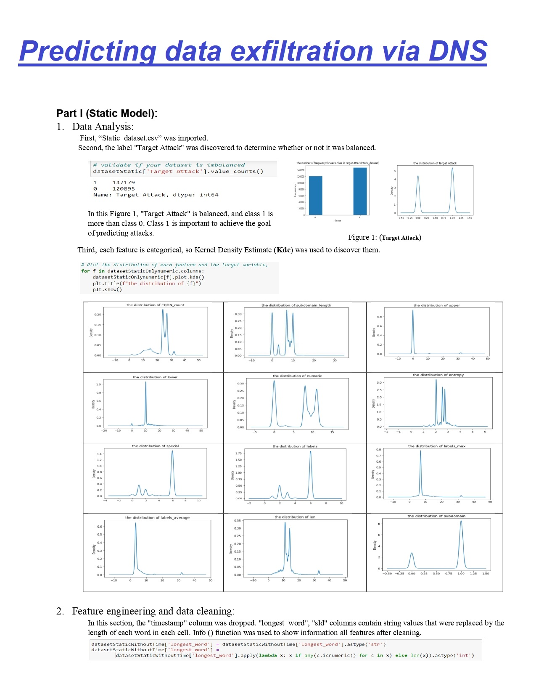
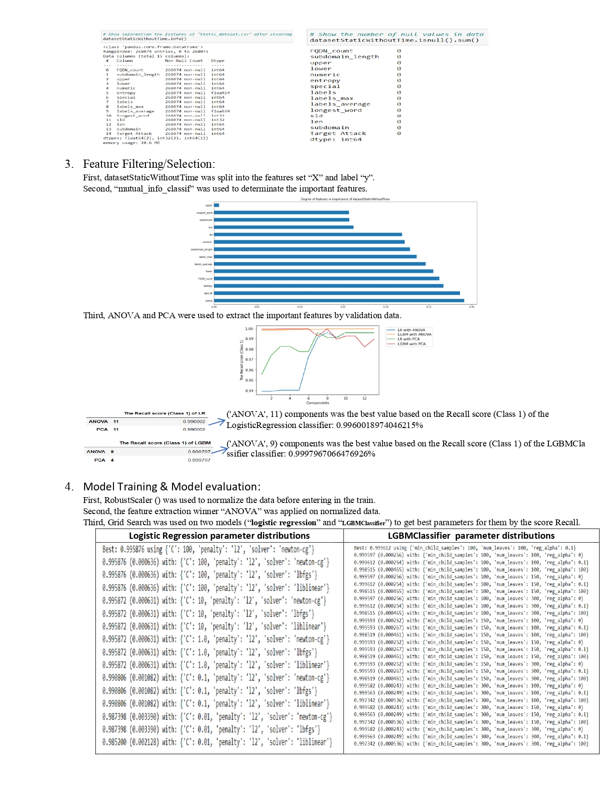
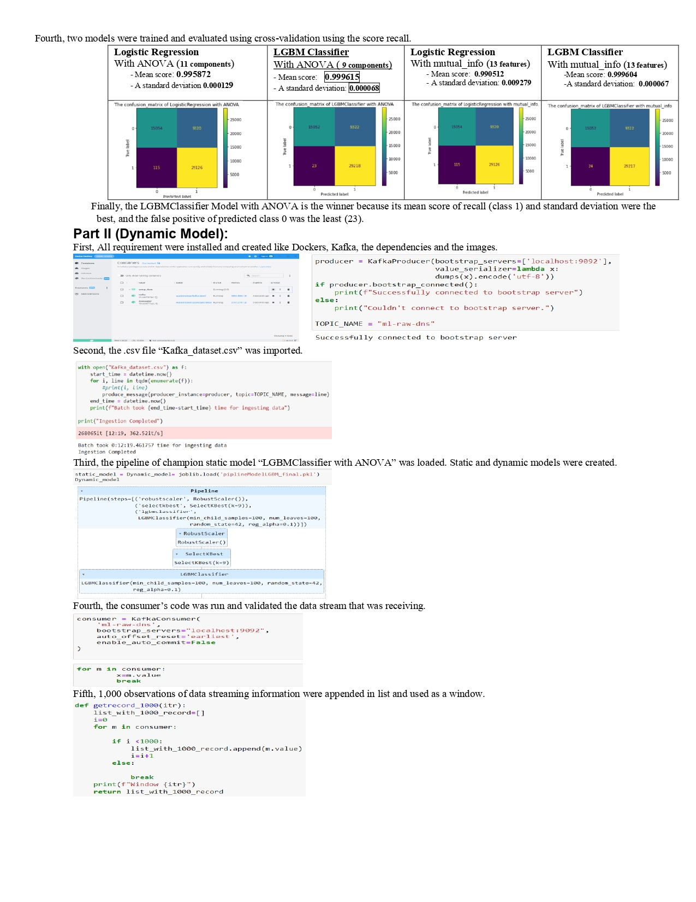
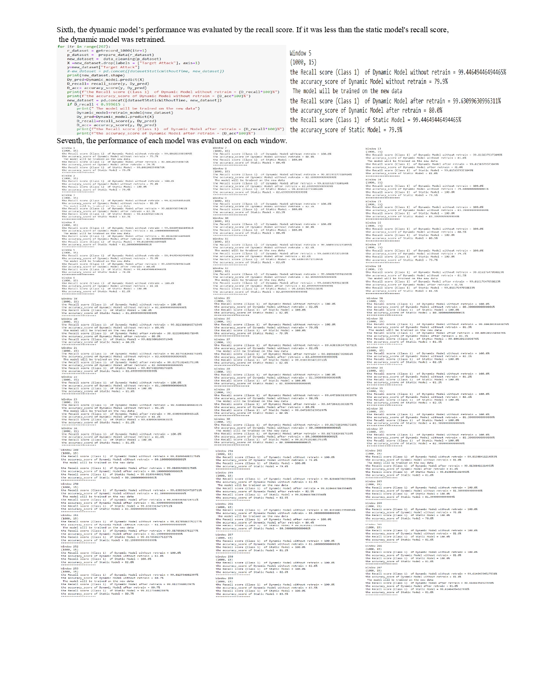
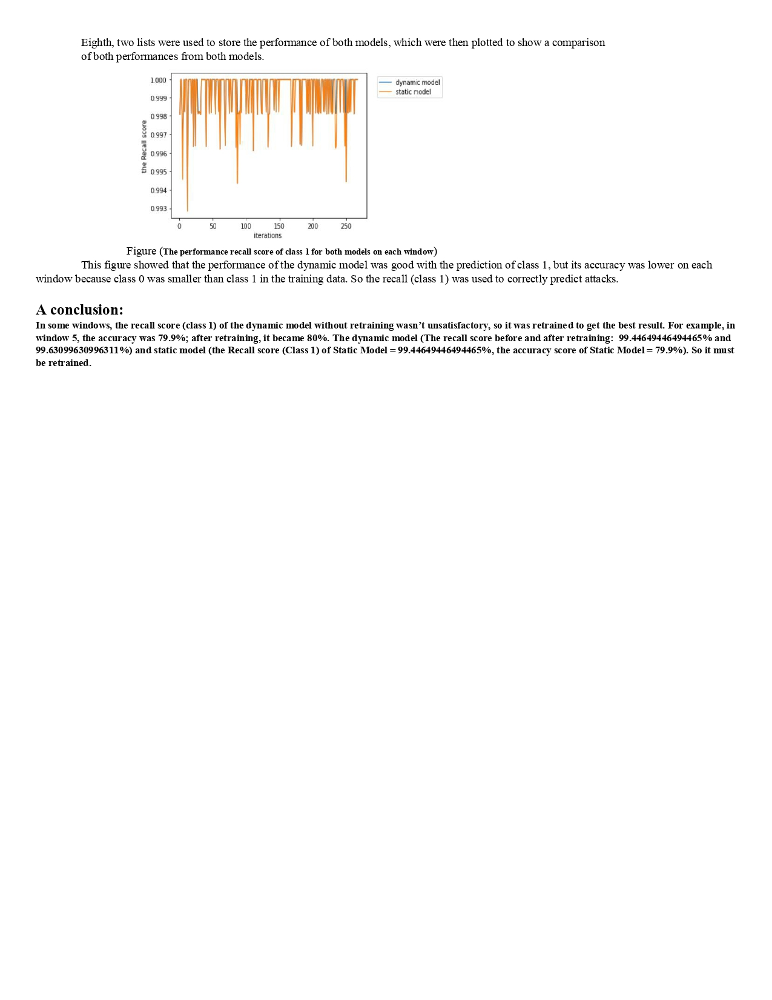

# Predicting data exfiltration via DNS

## PROBLEM DEFINITION:
#### For both problems you will have 2 independent datasets, that should be treated accordingly:
- A “static_dataset.csv” file which you can use to train a static model.
- A “kafka_dataset.csv” file that you should treat as a data stream (local Kafka Server) which will be used to evaluate the dynamic model.

## <h2>Description</h2>
## Part I (Static Model):
Welcome, you are now part of the Canadian Centre for Cyber Security, yesterday the Prime Minister approved the financial support to create our group and our first task will be to create a static Machine Learning Model based on batch data. You will be provided with top secret files obtained from our allies Ring Canada (RC) and the Cyber Threat Intelligence (CTI). The dataset provided to you has DNS traffic generated by exfiltrating various file types ranging from small to large sizes. Your job here will be to follow the standard ML cycle and train the best model possible.

## Part II (Dynamic Model):
The Chief of Cyber Security has read your report and the managing directors are threatening with closing down our branch because even though your results were outstanding, we are not using enough technological tools as they would like. In order to fulfill the board’s requests our analysis team has proposed to make an alternative analysis using Online Learning. The purpose of this second task will be to simulate a real-life scenario of a constant data stream. Make predictions on the new data that arrives in realtime and register the performance of two different models.

## Solution:

